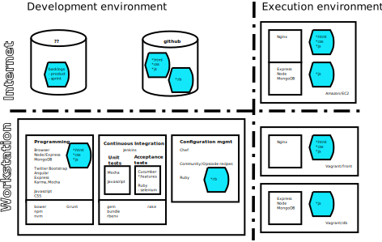

# <a id="1-SPEC>Devcc Architecture</a>

## <a id="CONSTRAINTS-AND-SCOPE">Constraints and Scope/a>

* Constraints
  * Max 8 hours

* Objective
  * To identify non-functional requirements in product backlog
  * Address the [documented concerns](README.md#CONCERNS) 
  * Give on overview 
  
* Scope  
  * Define a feasible development pipeline, which
    * uses state of the art tools
	* is "efficient"
	* can scale up

* Working methods
  * --> use bullet lists (to be transferred into product backlog)
  * --> if required Architecture may documented in more polished manner later
  * Tools
    * markdown
	* [Dia](http://en.wikipedia.org/wiki/Dia_%28software%29)
	* [ArgoUML](http://argouml.tigris.org/)

## <a id="CONCERNS">Concerns</a>

* An a professional developer uses the right tools for the right
  job. Installing and managing a large tool set may distract the
  attention from "programming" i.e. from the "real work". How can we
  avoid this in this exercise?
  
* I would like to get a "big picture" of the "developer work", and
  some pointers, how dig deeper on some subject. By the way, what
  these "subjects", any how (I am not sure that I know the before
  hand)
  
* Do we have to install, understand and use all development pipeline
  tools? Are all the tools equally important? What happens if we
  encounter problem with some tool, what do miss if I do not skip
  installing some tool?
  
* We are talking of a "development pipeline". Does this mean that the
  development work goes through some kind of steps. What are these
  steps, and how do they add value to the product being developed?
  

## System Architecture

### Architectural Decisions

### Concerns addressed

## Logical Architecture

### Architectural Decisions

## Development Architectures

### Architectural Decisions

### Concerns addressed

[up](../README.md) [resume](../README.md#1-DEFINE-ARCHITECTURE) [top](README.md)

