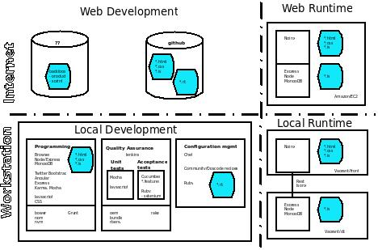
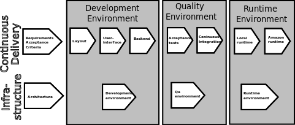

# On dfeiDevcc Architecture

## Constraints and Scope

* First version of this document: max 8h

* Objective
  * To identify initial architecture requirements in product backlog
  * Address the [documented concerns](#CONCERNS) 
  * Give on overview of our exercise
  
* Scope  
  * Define a *Minimum Feasible Deployment Pipeline*, which
    * uses state of the art tools
	* is "efficient"
	* can scale up
	* can be extended 

* Working methods
  * --> use bullet lists (to be transferred into product backlog)
  * --> if required Architecture may documented in more polished manner later
  * Tools
    * GIT-markdown
	* [Dia](http://en.wikipedia.org/wiki/Dia_%28software%29)
	* [ArgoUML](http://argouml.tigris.org/)

* See [Architectural Decisions](#Architectural-Decisions) below

## Concerns

### CONCERN-1

The professional developer uses the right tools for the right
job. Installing and managing a large tool set may distract the
attention from "programming" i.e. from the "real work". How can we
avoid this in this exercise?
  
### CONCERN-2

I would like to get a "big picture" of the "developer work", and some
 pointers, how dig deeper on some subject. By the way, what are these
 "subjects", any way (I am not sure that I know the before hand)
  
### CONCERN-3

Do we have to install, understand, and use so many development tools?
Are all the tools equally important? What happens if we encounter
problems with some tool? What do miss, if I do skip installing some of
the tools?
  
### CONCERN-4

What is this talking about a "Deployment Pipeline". Does this mean that
the development work flows through some kind of "pipe". What is the
pipe, and how does it add value to the product being developed?

## Reference Architecture

We use
[Continuous Delivery](http://www.slideshare.net/jezhumble/continuous-delivery-5359386)
as a reference architecture. *Continuous Delivery* is described in
more details in a [book](http://www.amazon.com/gp/product/0321601912)
by
[http://www.thoughtworks.com ](http://www.thoughtworks.com/continuous-delivery).

*Continuous Delivery* can be characterized 

 * It uses automated tests, continuous integration, small builds,
   smoke tests, etc. 
   * to get fast feedback on failures, 
   * and achieve short cycle times trough *Deployment Pipeline*
 * In addition to automated steps, *Continuous Delivery* uses manual
   steps, when automation is not possible (e.g. *User Acceptance
   Testing*)
 * Each commit to version control system is a *Potentially Deliverable
   Product*
 * Each step executed in *Deployment Pipeline* increases the quality
   of the product, and the confidence that the product version could
   be deployed in real production.
 * Once an artifact gets build/generated (e.g. compiled code,
   binaries, reports, metadata), it is stored in an artifact
   repository (as opposed to keeping the in version control system),
   allowing subsequent steps in pipeline to have 100% certainty that
   they are using unmodified artifact
 * All environments resemble production as much as possible, further
   down to the pipeline environments are even more production like.
 * Recommends commits to
   [Main Trunk](http://en.wikipedia.org/wiki/Trunk_%28software%29) (as
   opposed to creating
   [Branches](http://en.wikipedia.org/wiki/Branching_%28revision_control%29). This
   enables the effective use of
   [Continuous Integration](http://en.wikipedia.org/wiki/Continuous_integration)
   techniques.

## Developer Roles

The following picture shows **Developer Roles** identified for our
exercise:

**Developer**  is common name for a number more specific roles

* **Analyst** : Role which is further being decomposed to  *Requirements Analyst*, and *Test Analyst*

  * **Requirements Analyst** : Developer analysing requirements,
      understand business needs, and knows how to document them in a
      [SMART](http://en.wikipedia.org/wiki/SMART_criteria) way
  
  * **Test Analyst** : Define acceptance criteria for requirements
      agreed upon
	
* **Architect** : support as mediator between analysts and
    implementation developers, takes a broad view on infrastructure
  
* **User Interface Developer**: *implementation developer* responsible
    for user interface functionality, uses TDD and implements also
    unit tests corresponding the implementation units, parent for a
    sub-role *User Interface Layout Developer*

* **User Interface Layout Developer**: *implementation developer*
        responsible for visual aspect of user interface

* **Backed Developer**: *implementation developer* responsible for
      integrating back end systems and datastores, implement also unit
      tests for the code
  
* **Test Developer**: implement test, which are not unit tests,
    e.g. acceptance test implementation
  
* **Infrastructure Developer**: Further decomposed to *Development
      Infrastructure Developer* and *Runtime Infrastructure Management
      Developer*

  * **Development Infrastructure Developer**: deliver environment &
      configuration for *development*

  * **Runtime Infrastructure Management Developer**: deliver
      environment & configuration for *runtime*

### Methodologies, Technologies, Tools

* **Requirements Analyst** 
  * **Methodologies**
    * [INVEST requirements](http://en.wikipedia.org/wiki/INVEST_%28mnemonic%29)
  * **Technologies**
  * **Tools**
    * [Free Twitter Bootstrap 3.0 UI Mockup Templates for Keynote and PowerPoint](http://keynotopia.com/bootstrap/)
	* [Office Tools](http://office.microsoft.com/en-us/) or [LibreOffice](https://www.libreoffice.org/)
  
* **Test Analyst** 
  * **Methodologies**
	* [Behavior-driven development](http://en.wikipedia.org/wiki/Behavior-driven_development)
	* [Acceptance Testing](http://en.wikipedia.org/wiki/Acceptance_testing)
  * **Technologies**
  * **Tools**
    * [Cucumber](http://cukes.info/)

* **Architect** : support as mediator between analysts and implementation developers
  * **Methodologies**
  * **Technologies**
  * **Tools**
	* [Dia](http://en.wikipedia.org/wiki/Dia_%28software%29)
	* [ArgoUML](http://argouml.tigris.org/)

* **User Interface Layout Developer**
  * **Methodologies**
  * **Technologies**
	* [css](http://en.wikipedia.org/wiki/Cascading_Style_Sheets)
	* [html](http://en.wikipedia.org/wiki/HTML)
  * **Tools**
    * [Twitter Bootstrap](http://getbootstrap.com/)

* **User Interface Developer**
  * **Methodologies**
    * [Unit testing](http://en.wikipedia.org/wiki/Unit_testing)
	* [Test Driven _Development - TDD](http://en.wikipedia.org/wiki/Test-driven_development)
  * **Technologies**
	* [css](http://en.wikipedia.org/wiki/Cascading_Style_Sheets)
	* [html](http://en.wikipedia.org/wiki/HTML)
    * [Javascript](http://en.wikipedia.org/wiki/JavaScript)
  * **Tools**
	* [Bower](https://github.com/bower/bower)
	* [GruntJs](http://gruntjs.com/)
	* [AngularJS Framework](http://angularjs.org/)
    * [Twitter Bootstrap](http://getbootstrap.com/)
	* [Karma Test Runner](http://karma-runner.github.io/0.10/index.html)
	* [Mocha Unit test framework](http://visionmedia.github.io/mocha/)
	* [Chai assertion libray](http://chaijs.com/)

* **Backed Developer**
  * **Methodologies**
    * [Unit testing](http://en.wikipedia.org/wiki/Unit_testing)
	* [Test Driven _Development - TDD](http://en.wikipedia.org/wiki/Test-driven_development)
  * **Technologies**
    * [Javascript](http://en.wikipedia.org/wiki/JavaScript)
    * [Rest](http://en.wikipedia.org/wiki/Rest)
    * [Json](http://www.json.org/), [wikipedia](http://en.wikipedia.org/wiki/JSON)
  * **Tools**
	* [Bower](https://github.com/bower/bower)
	* [GruntJs](http://gruntjs.com/)
    * [NodeJs](http://nodejs.org/)
	* [Node Package Manager](https://www.npmjs.org/)
	* [ExpressJs](http://expressjs.com/guide.html)
	* [Karma Test Runner](http://karma-runner.github.io/0.10/index.html)
	* [Mocha Unit test framework](http://visionmedia.github.io/mocha/)
	* [Chai assertion libray](http://chaijs.com/)

* **Test Developer**
  * **Methodologies**
    * [Continuous Integration](http://en.wikipedia.org/wiki/Continuous_integration)
	* [Integration Testing](http://en.wikipedia.org/wiki/Integration_testing)
  * **Technologies**
  	* [Ruby](https://www.ruby-lang.org/en/)
	* [css](http://en.wikipedia.org/wiki/Cascading_Style_Sheets)
  * **Tools**
    * [Cucumber](http://cukes.info/)
	* [Selenium](http://docs.seleniumhq.org/)
	* [Jenkins](http://jenkins-ci.org/)
	* [Vagrant](http://www.vagrantup.com/)

* **Development Infrastructure Developer**
  * **Methodologies**
  * **Technologies**
   	* [Ruby](https://www.ruby-lang.org/en/)
  * **Tools**
    * [Node Version Manager](https://github.com/creationix/nvm)
	* [Groom your app’s Ruby environment](https://github.com/sstephenson/rbenv)
	* [Vagrant](http://www.vagrantup.com/)

* **Runtime Infrastructure Management Developer**
  * **Methodologies**
  * **Technologies**
  	* [Ruby](https://www.ruby-lang.org/en/)
  * **Tools**
    * [Configuration Management Tool Chef](http://docs.opscode.com/)
      * [berkshelf](http://berkshelf.com/)
	  * [Opscode Community Cookbooks](http://community.opscode.com/)
	* [Vagrant](http://www.vagrantup.com/)
    * [Bash](http://en.wikipedia.org/wiki/Bash_%28Unix_shell%29)
	* [Amazon EC2](http://aws.amazon.com/ec2/)

### Concerns addressed

[CONCERN-1](#CONCERN-1), [CONCERN-3](#CONCERN-3):
the tool set has been split up to manageable chunks, *Development
Infrastructure Developer* role is critical in bootstrapping the tool
set, careful risk management needed for activities performed by this
role

[CONCERN-2](#CONCERN-2): roles represent typical development
tasks, technology list acts as a pointer how find out more of the work
these roles do

[CONCERN-4](#CONCERN-4): the roles are active trough various
development phases

## System Architecture

[pdf](SystemArchitecture.pdf)

Presented in four quadrants

* Local Development Environment 
* Local Runtime Environment 
* Web Development Environment 
* Web Runtime Environment 

**Local Development Environment**:

* Three sub-environments identified
  * for Programming
  * for Quality Assurance
  * for Configuration Management

* Programming
  * Bootstrap 
  * Development runtime: Browser, NodeJS/Express, MongoDB
  * Implementation technologies: javascript, css, and html code

* Quality Assurance
  * Bootstrap 
  * Continuous Integration: Jenkins
  * Acceptance Testing: Cucumber, Selenium
  
* Configuration Management
  * Chef + Opscode Community Recipes
  * Implementation: Chef Ruby language

**Local Runtime Environment**:

* Vagrant/VirtualBox virtualization

* 2-tier application runtime architecture
  * Webserver: Nginx
  * integration using REST/Json
  * DB server: MongoDB, NodeJs

**Web Development Environment**

* Github
* ??

**Web Runtime Environment**:

* Amazon EC2
  * Automated Deployment

### Concerns addressed

[CONCERN-2](#CONCERN-2): System Architecture shows the big
picture

[CONCERN-3](#CONCERN-3): System Architecture shows maps the
tool to architectural context.

[CONCERN-4](#CONCERN-4): System Architecture shows system context,
where "Deployment Pipeline" is executed.

## Logical Architecture

 [pdf](logical-in-time.pdf)

The picture above shows, how the Systems Architecture is logically
divided into two swim lanes for `Continuous Delivery` and
`Infrastructure`. 

* `Continuous Delivery` : the 'real development' work
* `Infrastructure` : supports, bootstraps *Continuous Delivery*

Initial tasks (before implementation):

* collect `Requirements`
* define `Acceptance Criteria` for the requirements
* design `Architecture`

Implementation flows trough three environments `Development
Environment`, `Quality Environment` and `Runtime Environment`.

The environments are composed of smaller units (`Sub-Environments`),
corresponding the developer roles above:

* **Development Environment**: 
  * **layout**: *User Interface Layout Developer*
  * **user inteface**: *User Interface Developer*
  * **backend**: *Backed Developer*
  * **development environment**: *Development Infrastructure Developer*
* **Quality Environment**:
  * **acceptance tests**: *Test Developer*
  * **continuous integration**: *Test Developer*
* **Runtime Environment**
  * **local runtime**: *Runtime Infrastructure Management Developer*
  * **Amazon runtime**: *Runtime Infrastructure Management Developer*

### Concerns addressed

[CONCERN-2](#CONCERN-2): "Development work" proceeds trough several
environments supported by underlying infrastructure.

[CONCERN-1](#CONCERN-1), [CONCERN-3](#CONCERN-3): We proceed using the
logical swim lane model. Infrastructure should be available at the
time of work in an environment starts. The logical model corresponds
roles presented earlier, and this information can be used to identify
technologies and tools needed.

[CONCERN-4](#CONCERN-4): "Development work" flows trough the
Environments

## Architectural Requirements

(Not in any particular order)

### ARCH-1: Unit tests are running continuously in Dev. Environment

### ARCH-2: Acceptance test can be run without CI-environment

In other words: Continuous Integration Environment optional.

### ARCH-3: Support TDD principles

### ARCH-4: Automate infrastructure builds

### ARCH-5: Amazon and Local RT-env. similar

### ARCH-6: Bootstrap instructions for each environment 

### ARCH-7: 

## Architectural Decisions

* Focus Web technologies (Java ja .Net technologies not covered)
* Security testing, performance testing not covered here
* User Acceptance testing not covered here
* Other roles not covered: e.g. integration developer
* Two tier application architecture (front/db -layers)

[up](../README.md) [resume](../#1-DEFINE-ARCHITECTURE) [top](README.md)

